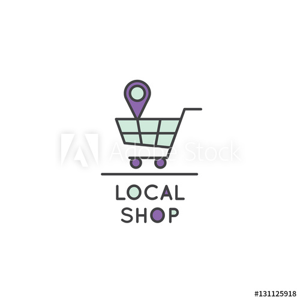
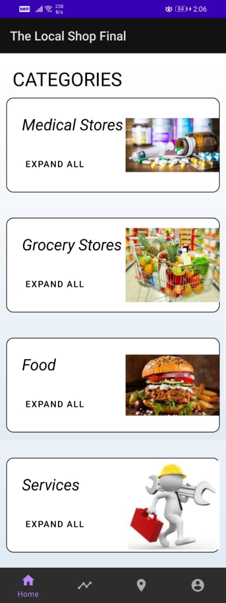
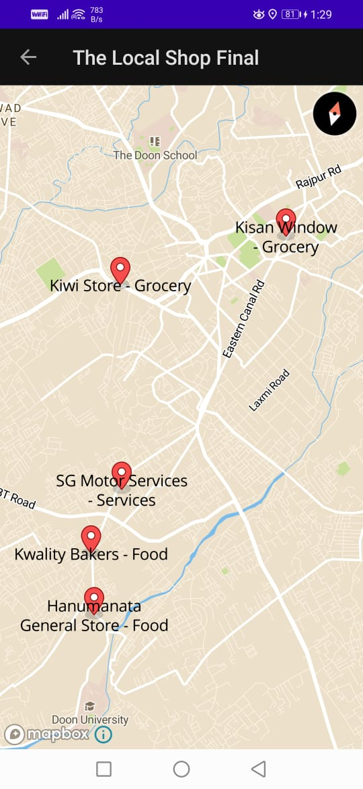

# The Local Shop
[Amazon HackOn](https://hackon-with-amazon.hackerearth.com/) Submission from Team - Vocal For Local.

<p align="center">
  
</p>

## Inctroduction
Our objective was to help the people fetch their daily essentials from Local stores without having to step out. With this we aim at promoting the Local stores and help out people who have no one at home to get daily grocery and other stuff.
Our method of implementation was building an app that will be handy for both the parties, the customer and the seller. We wanted to incorporate all the products and serivces that we require, and build something that fulfils the need of the people.
We came up with four categories which were -
* Food/Eatables
* Grocery
* Medicine
* Services

## Technology
Our application is android based, it uses the following technologies and developement environments.
* Android Studio
* Java
* XML
* Google Firebase
* Mapbox SDK for Android

## Snapshots
The Customer Home Screen and the Map Screen with Store locations are shown below.
<div align="center">
  
  
</div>

## Setup
CLoning the repository on our local system. Use the following command to clone the repository.
```
git clone https://github.com/chelsi-001011/the-local-shop.git
```
After cloning, open up the project in android studio. Connect your physical mobile device or create an emulator on android studio, then simply click on the 'Run' button to start the app. Follow the following links to set up your mobile device.
[Link](https://developer.android.com/training/basics/firstapp/running-app)

## Team

* [Avula Babtiha](https://github.com/babitha667)
* [Sugandhi Gupta](https://github.com/SugandhiGupta)
* [Priyal Sharma](https://github.com/Prl-1234)
* [Chelsi Rawat](https://github.com/chelsi-001011)
